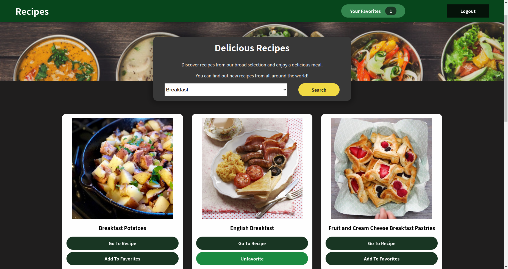
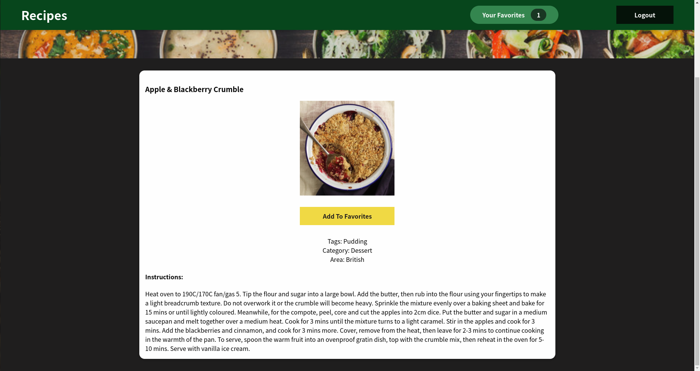
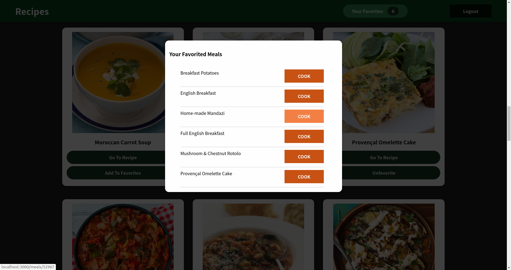
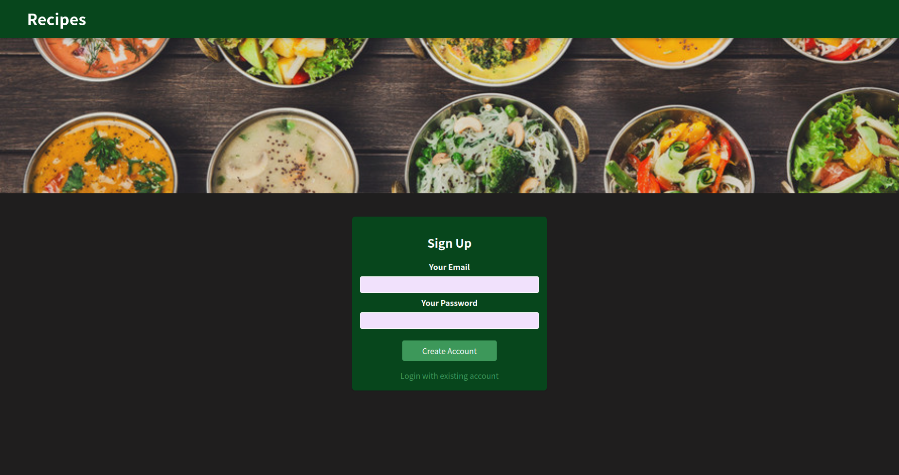

# Meal Recipes App

### `Developed with React, TheMealDB API & Firebase Auth REST API`

## API Integration:

- Meal recipes are fetched from TheMealDB API.
- User can view meals list by selecting different meal categories from the dropdown.
- Meal names and images are displayed in a card component.

## Authentication:

- Used Firebase Auth REST API for authentication.
- User can sign up and login via e-mail.
- User can logout.
- User is not able to see the recipes list or recipe details if they are not logged in.
- Only after logging in, user can see the Logout and Favorites Count button.

## Custom Hooks:

- User can favorite/unfavorite recipes.
- Custom store hook is implemented for this purpose, since this is a high-frequency feature and Context API would force unnecessary re-renders in this case.
- Badge on the right left corner is updated according to the new favorited meals count.
- Also, favorited meals can be seen on a modal after clicking Your Favorites, detail page of the meal can be viewed with Cook button.

## Routing:

- For routing, react-router-dom v6.3.0 is used.
- Recipe detail page is under /meals:id.
- User can view the detail recipe page of a meal, see the instructions, title, tags, category, area etc. and favorite/unfavorite meal in the detail page.
- Home page redirects to meals path only if user is logged in, otherwise auth page is displayed.
- Pages are protected if user is not logged in.

## React Context API:

- Context API is used to dispatch category action in Categories component and to fetch data according to the selected category in AvailableMeals component.
- Also used Context API for auth-context.

# Getting Started with Create React App

This project was bootstrapped with [Create React App](https://github.com/facebook/create-react-app).

## Available Scripts

In the project directory, you can run:

### `npm start`

Runs the app in the development mode.\
Open [http://localhost:3000](http://localhost:3000) to view it in your browser.

The page will reload when you make changes.\
You may also see any lint errors in the console.

### `npm test`

Launches the test runner in the interactive watch mode.\
See the section about [running tests](https://facebook.github.io/create-react-app/docs/running-tests) for more information.

### `npm run build`

Builds the app for production to the `build` folder.\
It correctly bundles React in production mode and optimizes the build for the best performance.

The build is minified and the filenames include the hashes.\
Your app is ready to be deployed!

See the section about [deployment](https://facebook.github.io/create-react-app/docs/deployment) for more information.

### `npm run eject`

**Note: this is a one-way operation. Once you `eject`, you can't go back!**

If you aren't satisfied with the build tool and configuration choices, you can `eject` at any time. This command will remove the single build dependency from your project.

Instead, it will copy all the configuration files and the transitive dependencies (webpack, Babel, ESLint, etc) right into your project so you have full control over them. All of the commands except `eject` will still work, but they will point to the copied scripts so you can tweak them. At this point you're on your own.

You don't have to ever use `eject`. The curated feature set is suitable for small and middle deployments, and you shouldn't feel obligated to use this feature. However we understand that this tool wouldn't be useful if you couldn't customize it when you are ready for it.

## Learn More

You can learn more in the [Create React App documentation](https://facebook.github.io/create-react-app/docs/getting-started).

To learn React, check out the [React documentation](https://reactjs.org/).

### Code Splitting

This section has moved here: [https://facebook.github.io/create-react-app/docs/code-splitting](https://facebook.github.io/create-react-app/docs/code-splitting)

### Analyzing the Bundle Size

This section has moved here: [https://facebook.github.io/create-react-app/docs/analyzing-the-bundle-size](https://facebook.github.io/create-react-app/docs/analyzing-the-bundle-size)

### Making a Progressive Web App

This section has moved here: [https://facebook.github.io/create-react-app/docs/making-a-progressive-web-app](https://facebook.github.io/create-react-app/docs/making-a-progressive-web-app)

### Advanced Configuration

This section has moved here: [https://facebook.github.io/create-react-app/docs/advanced-configuration](https://facebook.github.io/create-react-app/docs/advanced-configuration)

### Deployment

This section has moved here: [https://facebook.github.io/create-react-app/docs/deployment](https://facebook.github.io/create-react-app/docs/deployment)

### `npm run build` fails to minify

This section has moved here: [https://facebook.github.io/create-react-app/docs/troubleshooting#npm-run-build-fails-to-minify](https://facebook.github.io/create-react-app/docs/troubleshooting#npm-run-build-fails-to-minify)
